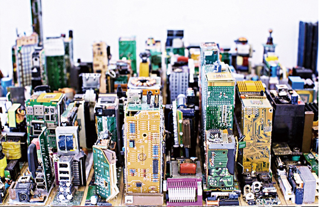

  

After the college entrance exam, I had a lot of free time. I decided to spend my free time building a computer. I had never made a computer before, and I thought it would be a beneficial project. I selected all the computer parts for PC part selector and checked compatibility. My project could have failed, but I was still excited about making my computer.

After all the parts I made came in, I started to make a computer. It was quite difficult because it was my first time, but I was able to do a complicated process while watching YouTube. Cable was by far the hardest part of the process. The computer was completed and the operating system decided to install Windows 10.

Before making a PC, I knew little about the hardware related to the computer. Also throughout the making process, I would do my own research on what hardware does and how computers actually work. I could certainly learn about PC structure through this project.

